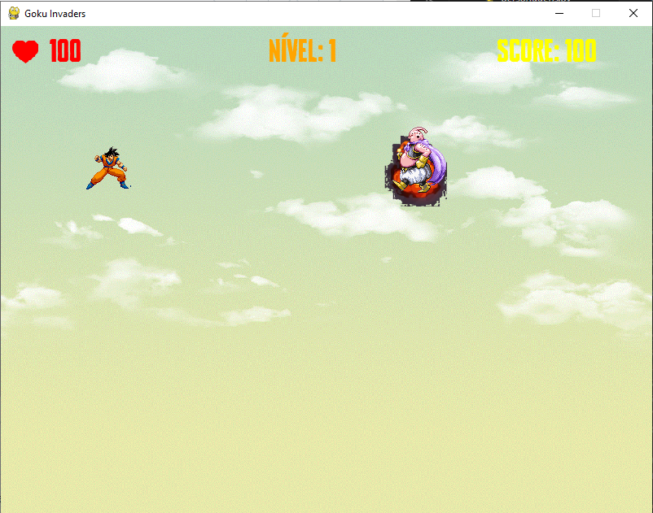

# Goku-Invaders

## 🎮 Sobre o Jogo

O jogo criado é uma versão modificada do clássico “Space Invaders”.<br> Na nossa versão o jogador irá controlar o “Goku” que se desloca verticalmente com o objetivo de destruir os inimigos para salvar a sua amada “Kika”.<br>Atira projéteis para destruir os inimigos.<br>O jogo conta com progressão por níveis, historia entre níveis e um sistema de pontuação.   
---

## 🛠️ Tecnologias Utilizadas

- **Linguagem:** [Python]
- **Bibliotecas/Frameworks:** 
  - [Pygame] - Ferramenta para criar jogos com som, gráficos e interatividade.
  - [open.cv] - Biblioteca para processamento de imagens e visão computacional.
  - [numpy] - Utilizada para cálculos matemáticos com vetores e matrizes.
  - [random] - Gera números aleatórios, útil para jogos e simulações.
  - [os] - Permite interagir com o sistema operacional, manipulando arquivos e pastas.
  - [PyInstaller] -  Converte scripts Python em executáveis independentes.
  
- **Assets:** Imagens e sons foram criados ou obtidos de repositórios livres de direitos autorais.
  
---
##<b>Donwload do jogo</b>: <a>https://we.tl/t-lcWIJTE9Y2<a> <p>Link disponivel até <b>21-01-2025</b> </p>

## 🚀 Como Jogar

1. Clone o repositório:
   ```bash
   git clone [https://github.com/luisolivei/Goku-Invaders]
   ```

2. Navegue até a pasta do projeto:
   ```bash
   cd Goku-Invaders
   ```

3. Instale as dependências (se necessário):
   ```bash
   # Exemplo para Python
   pip install -r requirements.txt
   ```

4. Inicie o jogo:
   ```bash
   python main.py
   ```

5. Controles:
   - **Setas Direcionais: Cima/Baixo** Mover Goku
   - **Barra de Espaço:** Atirar
   - **X** Ataque especial
   - **Enter** Passar historia
   - **Esc** menu/pausa
   - **M** Som ON/OFF

---
## 📚 Estrutura do repositorio
**Pasta Sons**: Contém efeitos sonoros e músicas do jogo.<br>
**Pasta Imagens**: Imagens e sprites utilizados.<br>
**Pasta Fonts**: Fontes utilizadas no jogo.<br>
**Arquivos principais**:<br>
  -**main.py**: Contém o loop principal do jogo.<br>
  -**config.py**: Configurações gerais como resolução e velocidades.<br>
  -**menu.py**, **highscore.py**, **inimigos.py**: Implementação de menus, pontuações e inimigos.<br>

---

## 🖼️ Capturas de Tela



---

## 📚 Funcionalidades

**Personagem Principal**:
Controle o Goku em movimento vertical para enfrentar inimigos.
Ataque especial desbloqueado após eliminar três inimigos consecutivos.

**Sistema de Inimigos**:
Vários tipos de inimigos, com movimentos e padrões de ataque específicos.
Inimigo final com mecânicas únicas, incluindo ataques múltiplos e movimentação dinâmica.

**Progressão por Níveis**:
A dificuldade aumenta com níveis progressivos.
Mudanças no fundo e inimigos para maior variedade visual e de gameplay.

**Sistema de Pontuação**:
Registro e exibição de pontuação mais alta (highscores).
Pontuação acumulada ao derrotar inimigos e progredir.

**Gestão de Vidas e Colisões**:
Perda de vidas ao sofrer dano de inimigos ou projéteis.
Tela de Game Over ao esgotar as vidas.

**Efeitos Sonoros e Música**:
Sons personalizáveis, incluindo música de fundo e efeitos para disparos e colisões.
Controle de volume para músicas e efeitos sonoros individualmente.

**Menus e Navegação**:
Tela inicial com opções para começar o jogo, visualizar highscores ou sair.
Menu de pausa com opções para continuar, sair ou mostrar pontuações.
Tela de instruções para ajudar novos jogadores.

**Transições e Animações**:
Efeitos de fade-in e fade-out entre telas.
Animações fluidas para o personagem e inimigos.


---

## 🛡️ Créditos

- **Desenvolvedores**:<br>
  **Tiago Bastos<br>
  Luís Oliveira,<br>
  Carina Gameiro,<br>
  Aleff Almeida,<br>
  Guilherme Borges**
  
---

## 📜 Licença

Este projeto está licenciado sob a [MIT License](LICENSE). Sinta-se à vontade para usar, modificar e distribuir!

---

**Divirta-se a jogar! 🚀👾**
